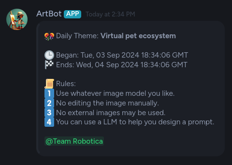

# 🎨 Art Contest Discord Bot v0.1


## Table of Contents
- [Overview](#overview)
- [Key Features](#key-features)
- [New Features](#new-features)
- [Planned Features](#planned-features)
- [Installation](#installation)
- [Setup and Configuration](#setup-and-configuration)
- [Usage](#usage)
  - [Adding a Contest](#adding-a-contest)
  - [Deleting a Contest](#deleting-a-contest)
- [Customizing Topics](#customizing-topics)
- [AI Topics](#ai-generated-topics)
- [Transpiling to Native JavaScript](#transpiling-to-native-javascript)
- [Frequently Asked Questions](#frequently-asked-questions)
- [Changelog](#changelog)

## Overview

The Art Contest Discord Bot brings excitement to your server by automatically hosting art contests! It's designed to be flexible, reliable, and easy to customize. Please note that this bot is still in alpha stages; while usable, some features may not work properly.

## Key Features

- 🚀 **Automated Contests**: Sends out ArtContest messages at configurable intervals.
- 📚 **Diverse Topics**: Draws from a JSON file of 100 prepared topics.
- 🔄 **No Repeats**: Never draws duplicate topics until all have been used.
- 📬 **Role Mentions**: Notify users by mentioning specific roles.
- 👉 **Customizable**: Easily add your own topics by editing `src/projects.json`.
- 💡 **Smart Event Handling**: 
  - Remembers the next contest time even if offline.
  - Adjusts contest times if offline during a scheduled event.
  - Displays notices upon coming back online if contests were missed.

## New Features

- 🤖 **AI-Enabled Themes**: Automatically refreshes topics with unique new ones using the Anthropic API when all existing themes have been used.
- ❌ **Contest Deletion**: New `/artbot-deletecontest` command to remove contests from the current channel.

## Planned Features

- 🙋 **Reaction System**: React to posts to be added or removed from groups.
- 🪙 **ArtCoin System**: Earn ArtCoins by reacting to others' art. Collect the most to win!

## Installation

1. Clone the repository:
```bash
git clone https://github.com/hazlema/ArtBot.git
cd ArtBot
```

2. Install dependencies:
```bash
bun install
```

## Setup and Configuration

1. Create a `src/.env` file with your bot authentication info:
```
TOKEN_ID=[Your bot's token]
APP_ID=[Your application ID]
ANTHROPIC_API_KEY=[Your Anthropic API key]
```

- [Get a key](https://console.anthreopic.com/)
- **Note**: If you don't want to use the AI feature, omit the ANTHROPIC_API_KEY.

2. Run the bot:
```bash
bun run bot
```

3. Invite the bot to your server using [these instructions](https://discordjs.guide/preparations/adding-your-bot-to-servers.html#bot-invite-links).


## Usage

### Adding a Contest

1. Go to the channel where you want to run the contest.
2. Type: `/artbot-addcontest [name of the contest] [hours between contests] [mention]`


   - The `mention` parameter is optional.
   - Times are displayed in GMT.
   - Time intervals are in hours (e.g., 24 for daily, 168 for weekly).




### Deleting a Contest

1. Go to the channel where you want to delete the contest.
2. Type: `/artbot-deletecontest`


## Customizing Topics

To add or modify contest topics:

1. Open `src/projects.json`
2. Edit the JSON array of topics.
3. Save the file and restart the bot.

Note: If you customize topics, consider disabling the AI module.

### Generating New Topics

Use your favorite LLM with a prompt like:
```
Create a JSON file with 100 entries for digital art topics. 
Format: { "topics": [ "Neon underwater civilization", ... ] }
Keep entries under 10 words in length.
```

### AI-Generated Topics

- When AI topic generation is enabled, the bot uses the following prompt to generate new topics:
- All you have to do to enable this feature is [add the API key for Anthropic](#setup-and-configuration) to the **src/.env** file.

```
Can you create a json file with 10 entries, these entries should be text fields
and contain a digital art topic. Something like: Neon underwater civilization,
impressionistic painting of woman eating an apple, or cartoon of a mouse being
mischievous try to keep the entries under 10 words in length. And please do not
use any of the suggested topics. randomize as much as possible.
```

This ensures a wide variety of unique and creative topics for your art contests.


## Transpiling to Native JavaScript

For compatibility with hosting providers that don't support Bun:

1. Run: `bun run build`
2. Deploy the contents of the `dist` directory.

A pre-built JavaScript version is available in the releases section of the repository.

## Frequently Asked Questions

Q: I've set up the bot and it's running, but it's not in my server. What should I do?
A: You need to invite the bot to your server. Follow the instructions [here](https://discordjs.guide/preparations/adding-your-bot-to-servers.html#bot-invite-links).

## Changelog

- 9/8/2024: Fixed an issue where the scheduling date sometimes didn't load properly.
- 9/8/2024: Refactored select.ts
- 9/9/2024: Added Logging

---

Enjoy fostering creativity in your Discord community with the Art Contest Bot! 🎭🖌️

This project was created using `bun init` in bun v1.1.26. [Bun](https://bun.sh) is a fast all-in-one JavaScript / TypeScript runtime.