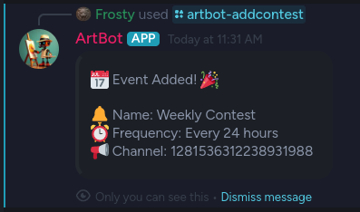

# 🎨 Art Contest Discord Bot, v0.1


## Overview

This Discord bot brings excitement to your server by automatically hosting art contests! It's designed to be flexible, reliable, and easy to customize.

### Key Features

- 🚀 **Automated Contests**: Spits out ArtContest messages at configurable intervals.
- 📚 **Diverse Topics**: Draws from a JSON file of 100 prepared topics.
- 🔄 **No Repeats**: Never draws duplicate topics until all have been used.
- ✏️ **Customizable**: Easily add your own topics by editing `src/projects.json`.
- 💡 **Smart Event Handling**: 
  - Remembers the next contest time even if offline.
  - Adjusts contest times if offline during a scheduled event.
  - Displays notices upon coming back online if contests were missed.

## Features Planned

- 🙋 Will have a reaction system where you can react to a post and be added or removed from groups
- 🪙 Will have a ArtCoin system, where you get an ArtCoin every time you react to someones art!  (see if you can collect the most!)

## Commands

- Go to the channel where you want to run the contest
- Type in: `/addcontest [name of the contest] [time between contests]`
Example: `/addcontest Daily Contest 24hrs`



Time intervals will be in hours:
- 24hrs is one day
- 168hrs is one week


## Setup and Configuration

1. Clone the repository
2. Install dependencies
3. Configure your Discord bot token
4. Create the src/.env file with your bot authentication info
5. Set your desired contest frequency in the configuration file
6. Run the bot!

## Customizing Topics

To add or modify contest topics:

1. Open `src/projects.json`
2. Edit the JSON array of topics
3. Save the file
4. Restart the bot (if it's running)

### Generate new topics easily

Go to your favorite LLM and use a prompt like:
```
can you create a json file with 100 entries, these entries should be text fields and contain a digital art topic.  
Something like: "Neon underwater civilization", try to keep the entries under 10 words in length. 
The JSON file should be in the format of { "topics": [ ] }
```

## Usage

Once set up, the bot will automatically:

- Announce new art contests in your designated Discord channel
- Provide a unique topic for each contest
- Manage the contest schedule, even through downtime

Sit back and watch as your community engages in creative challenges!

## Setting up the src/.env file

Open a text editor and copy and paste the information from the discord bot page
```
TOKEN_ID=[Your bots token]
APP_ID=[Your application ID]
```

---

Enjoy fostering creativity in your Discord community with the Art Contest Bot! 🎭🖌️

---

# Technical Section

[Download and install bun](https://bun.sh)

## To install the bot:

```bash
git clone https://github.com/hazlema/ArtBot.git
cd ArtBot
bun install
```

To run:

```bash
bun run bot
```

## Transpiling to Native JavaScript

While Bun is gaining popularity, not all hosting providers support it yet. Don't worry though – you can easily convert your Bun project to pure JavaScript, ensuring compatibility with virtually any hosting environment.

### How to Transpile

1. Run the following command in your project directory:

   ```
   bun run build
   ```

2. This will generate a `dist` directory containing:
   - A comprehensive JavaScript file
   - The necessary JSON file(s)

You can now deploy these files to any hosting provider that supports Node.js, which is nearly universal among web hosting services.

### Convenience for Users

**Note:** To save you time and effort, I've included a pre-built pure JavaScript version in the releases section of this repository. You can download and use this version directly if you prefer not to run the build process yourself.

By transpiling to native JavaScript, you're ensuring maximum compatibility while still leveraging Bun's excellent development experience. It's the best of both worlds!

---

This project was created using `bun init` in bun v1.1.26. [Bun](https://bun.sh) is a fast all-in-one JavaScript / TypeScript runtime.
